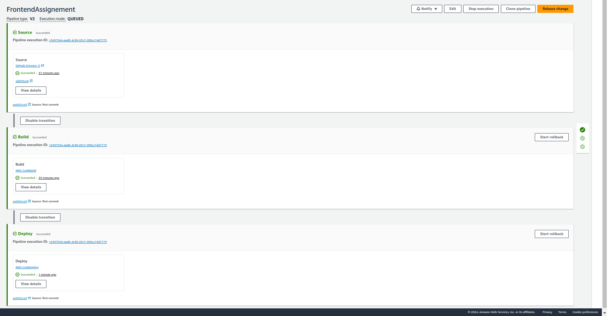
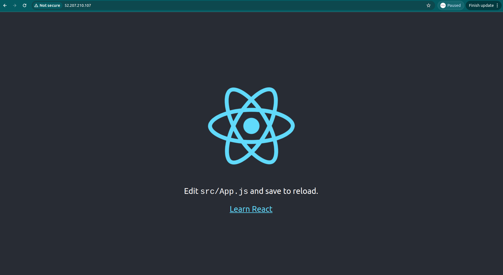

# Frontend Deployment (REACT APPLICATION)
- Create IAM Roles (EC2 role to access S3, CodeDeploy Role to attach to codedeploy)
- Create an EC2 to deploy application
- Attach EC2 role to EC2
- Add the ec2 user
- Install code deploy agent in the EC2, ensure it's running
- Create Codepipeline (CodeBuild, CodeDeploy)
- Test if the deployment was a success by accessing http://ip-address
- Test the pipeline by pushing some changes.

## Expected outcomes

